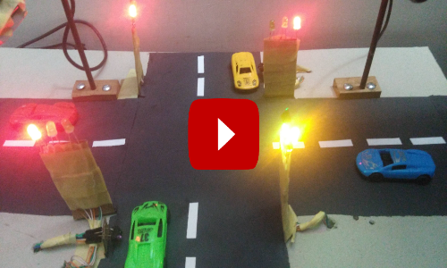
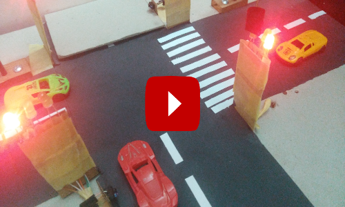
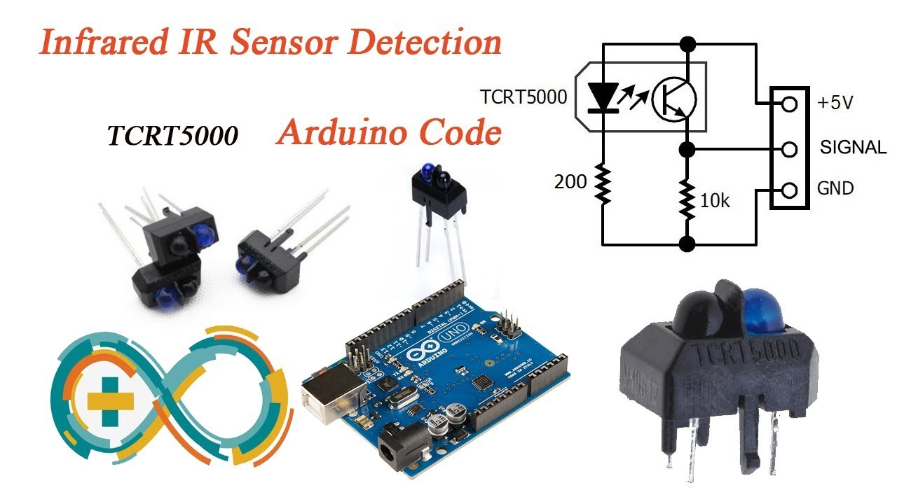
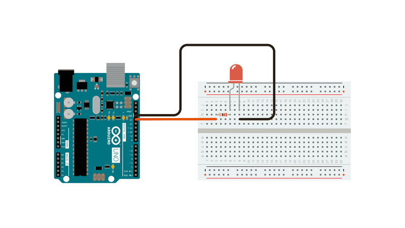

## Smart Trafic Light Control System

### Objective
To control traffic lights efficiently based on traffic congestion. 

### How this Model works 
   Time sharing based but efficiency is achieved by adopting following 
   techniques
   - green light will be "on" only when vehicles presence on the lane.
   - add more time to lanes when high congession occurs
   - periodical processing of traffic lanes
             
        

### Working Model
 - Application written in Python and runs in windows environment
 - Vehicle present in lanes is detected by sensors and web cams
 - Sensors are connected to Arduino board and Arduino board
   connected to application windows machine via serial port. Application
   will communicate with application running in Arduino to read sensor
   data. Application will determine presence of traffic by received values
   of Sensor data.
 - Web cams are directly connected to windows machine and images of
   vehicle movements on lanes are detected and processed by
   Python/OpenCV
 - LEDs are used as traffic lights which are connected to Arduino board
   and application communicates with Arduino to on/off LEDs 

### Requirements
   This Model has been built to work under following software/hardware environments  
   - Windows 10 home
   - Python 3.9.6
   - OpenCV 4.5.2
   - PySerial 3.5  
   - Web Cams  
   - Arduino components  
        - Arduino GUI 1.8.15  
        - Arduino UNO board  
        - TCRT 5000 reflective optical IR sensors  
        - LEDs as Trafic lights    
        
  

### To Run Application
- py videom.py sit1.txt  
     System Initialization Table is passed as first parameter (sit1.txt)
- before starting the application
   - tfrcntl.ino Arduino file under “tfrcntl” folder must be uploaded to
     Arduino board using Arduino GUI
   - All sensors, web cams and LEDs must be checked

### System Tables
Configuration information is given to application using tables
which are JSON based data structures
#### System Initialization Table
This is the main table (sit1.tx) which specifies information of other tables  

    {  
    "videom":"videosm1.txt",  
    "videop":"videosp1.txt",  
    "tlc":"videotlc1.txt",  
    "comps":{"c1":["COM3",9600,5,2]}  
    }  
    videom - Lane Definition Table which defines sensor and web cam information  
    videop - Priority Assign Table which is used assign more time to when high congetsion occurs in lanes  
    tlc    - Traffic Light Control table where traffic lights data are specified  
    comps  - Arduino board info  
           c1   - board id, there can be more than one board connecting sensors and LEDs  
           COM3 - is the port this board connects to application running machine  
           9600 - baud rate, data transfer rate of application running machine serial port and Arduino board  
           5    - time out will occur if unable to connect with Arduino within this time period ( milliseconds )  
           2    - wait time to connect with Arduino ( milliseconds )  
#### Lane Definition Table

      { "lane":1, "type":"s", "prtyid":["lane1-1"], "maxt":5, "skipc":0, "debug":"Y",  
        "parms": { "sensor":"A0 "comport":"c1", "sensorid":"s1", "rdelay":1, "rtime":200, "srtm":150 } },  
      { "lane":2, "type":"c", "maxt":5, "skipc":0, "debug":"Y",  
        "parms": { "cam":0, "camid":"cam1", "camtype":" ", "detectarea":[360,230,200,250],  
        "mincarea":1500, "rdelay":0.1, "rtime":1, "viewcam":1 } }  
             
      lane   - lane id  
      type   - 's' for sensor manage lane 'c' for web cam manage lane  
      prtyid - priority id, to add more time to high congestion lanes.  
               coresponding to this, entry in the priority Assign Table must be added  
      maxt   - maximum time allocated to lane in seconds  
      skipc  - processing frequency, to skip processing lanes (less congested) for spcfied  
               no of processing cycles
      debug  - 'y' or 'n' if 'y' - application will print debug info on console  
      parms  -  
         For Sensors
              sensor   - Analog pin of the Arduino, sensor is connected to ex. A0  
              sensorid - not relevant  
              comport  - Arduino board id this sensor is connected to which is defined in system  
                         initialization table  
              srtm     - Min value read from sensor to determine traffic is present in the lane  
              rtime    - Time in milliseconds sensor should be read continuesly to determine if traffic is  
                         presented in the lane  
              rdelay   - Time in milliseconds to wait before beginning reading cycle from sensor again  
  
              Desirable values for srtm, rtime and rdelay can be found out by running chksensor.py  
              
         For Cams  
              cam        - Number ex. 0,1,2.. Windows will assign a number to a cam  
              camid      - Not relevant  
              camtype    - Not relevant  
              detectarea - To determine traffic is presence, vehicle must be presence in this area of  
                           the lane. This is the coordinates ( x, y,width,height ) of cam view area  
                           application should detect vehicles  
              mincarea   - To filter objects and to identfy objects of interest  
              maxcarea     Herer the video image area ( contours of the image ) must be higher than this 
                           min value and less than this max value.
                           if zero specified for min/max  no min/max value comparission will be done  
              viewcam    - 1 to show video cam frames on the console  
              rtime, rdelay - Same as specified in sensor but specified in seconds  
              
              Desirable values for cam no, detectarea, mincarea, rtime and rdelay can be found out by  
              running chkcam.py.           
           
#### Priority Assign Table  

     { "prtyid":"lane1-1", "type":"s", "pt":20, "maxt":2, "debug":"Y",  
       "parms": { "sensor":"A3",  "comport":"c1", "sensorid":"s3", "rdelay":1, "rtime":50, "srtm":50 } }  
     
     prtyid - Value specified in the "prtyid" parm of a lane entry in the lane definition table.  
     pt     - If traffic is detected this amount of time (in seconds) is added to the value in 
              the "maxt" parm of the lane entry of the lane definition table  
            
     Other parameters are same as of lane definition table.

#### Traffic Light Control Table  

    { "lane":1,  
      "red":[ ["c1", [3,"O",0], [4,"F",1000], [2,"O",0], [3,"F",0] ] ],  
      "green":[ ["c1",[3,"O",0], [2,"F",1000], [4,"O",0], [3,"F",0] ] ]  
    }  
    
    lane - lane id
    red  - When application need to light up for example red light of the lane 1 it will 
           send Arduino board Id "c1" following message  
           1)  Wait for zero milliseconds and "On" LED connected to digital pin "3"  
               For example to on yellow  
           2)  Wait for 1000 milliseconds and "Off" LED connected to digital pin "4"   
               For example to off green  
           3)  Wait for zero milliseconds and "On" LED connected to digital pin "2"   
               For example to on red  
           4)  Wait for zero milliseconds and "Off" LED connected to digital pin "3"  
               For example to off yellow 
               
               There can be another entry as beleow
               [3,"B",0,1000,3000 ] --> To Blink --> Wait 0 millseconds, "On" led connected to pin "3", 
                                        wait 1000 milliseconds, "Off", wait 1000 miliseconds
                                        do this on/off process untill 3000 milliseconds  elapsed     
    green - to light up green, same as red  
    
    { "lane":99,  
      "red":[ ["c1", [2,"O",0], [5,"O",0], [8,"O",0], [11,"O",0] ] ]  
    }  
    lane '99' is a special lane, which is used by the system to set all red lights of lanes to "On"  
    when system is start up. Here red LEDs of lanes are connected to  digital pins 2, 5, 8 and 11 of Arudino  
    board
    
    
### Test System
After system is setup all the sensors, LEDs and web cams must be checked  

#### py chksensor.py COM3 A0  
To check a sensor connected to analog pin ( for ex. A0 ) of Arduino board connected to a   
serial port ( for ex. COM3 ) of windows  Here desirable values for "srtm", "rtime" and "rdelay" can be found ( by modifying chksensor.py program )  

#### py chkled.py COM3 2
To check LED connected to digital pin ( for ex. 2 ) 

#### py chkcam.py 0
To check Cam connected to windows machine ( for ex. cam 0 ).Here number assign to a cam by windows and desirable values for "detectarea", "mincarea" parms of the lane entry of lane definition table can be found ( by modifying chkcam.py program )  

### Conclusion
- This system is s single threaded and useful to control traffic in
moderately congested traffic.
- To achieve high efficiency and redundancy to handle high traffic lanes
we may have to deploy more than one sensors/cams to monitor lanes.
Such system will be multi threaded and we may have to deploy machine
learning techniques to determine time for lanes by considering traffic on
the lanes without allocating max times as in this model to achieve high
efficiency.
